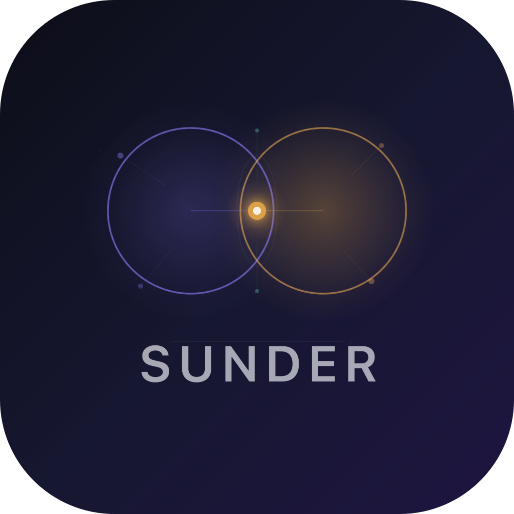

# Sunder

A local-first markdown research hub with semantic linking. Sunder surfaces hidden connections between your notes using on-device AI embeddings — no cloud, no telemetry, your research stays yours.



## What it does

- **Write** in a CodeMirror 6 markdown editor with syntax highlighting
- **Search** using hybrid full-text + semantic search (FTS5 + vector similarity with reciprocal rank fusion)
- **Discover** latent links — as you type, Sunder finds related notes you didn't explicitly connect
- **Visualize** your knowledge graph with force-directed layout, clustered by topic similarity
- **Import** a directory of `.md` files and keep them synced with a file watcher
- **Stay local** — ONNX inference runs on-device, SQLite stores everything, nothing leaves your machine

## Architecture

```
React 19 + TypeScript          Rust (Tauri 2)
┌──────────────────┐     ┌─────────────────────────┐
│  CodeMirror 6    │     │  NoteService (CRUD)      │
│  D3-force graph  │────▶│  EmbeddingService (ONNX) │
│  Settings UI     │ IPC │  SearchService (hybrid)   │
│  Latent links    │◀────│  LinkService (LRU cache)  │
│  Sidebar search  │     │  GraphService (clusters)  │
└──────────────────┘     │  FileWatcherService       │
                         │  SettingsService           │
                         └─────────────────────────┘
                                    │
                         ┌──────────┴──────────┐
                         │  SQLite + FTS5       │
                         │  sqlite-vec (ANN)    │
                         │  all-MiniLM-L6-v2    │
                         └─────────────────────┘
```

**Frontend**: React 19, Vite, TailwindCSS 4, CodeMirror 6, D3-force
**Backend**: Rust, Tauri 2, SQLite (r2d2 pool), FTS5, sqlite-vec
**AI**: ONNX Runtime (`ort`), HuggingFace `tokenizers`, all-MiniLM-L6-v2 (384-dim embeddings)
**Design**: "Deep Cartography" — dark/light themes, glassmorphic panels, amber/violet accent system

## Getting started

### Prerequisites

- [Rust](https://rustup.rs/) (stable)
- [Node.js](https://nodejs.org/) 20+
- Platform dependencies:
  - **macOS**: Xcode Command Line Tools
  - **Linux**: `libwebkit2gtk-4.1-dev libappindicator3-dev librsvg2-dev patchelf libssl-dev`
  - **Windows**: Visual Studio Build Tools with C++ workload

### ONNX model

Download the quantized model and tokenizer into `src-tauri/resources/`:

```bash
mkdir -p src-tauri/resources
curl -L -o src-tauri/resources/model_quantized.onnx \
  "https://huggingface.co/Xenova/all-MiniLM-L6-v2/resolve/main/onnx/model_quantized.onnx"
curl -L -o src-tauri/resources/tokenizer.json \
  "https://huggingface.co/Xenova/all-MiniLM-L6-v2/resolve/main/tokenizer.json"
```

### Development

```bash
npm install
npm run tauri dev
```

### Production build

```bash
npm run tauri build
```

Outputs:
- **macOS**: `src-tauri/target/release/bundle/macos/Sunder.app` + `.dmg`
- **Linux**: `src-tauri/target/release/bundle/appimage/Sunder.AppImage`
- **Windows**: `src-tauri/target/release/bundle/msi/Sunder.msi`

## Keyboard shortcuts

| Shortcut | Action |
|----------|--------|
| `Cmd/Ctrl+N` | New note |
| `Cmd/Ctrl+B` | Toggle sidebar |
| `Cmd/Ctrl+G` | Toggle graph view |
| `Cmd/Ctrl+K` | Focus search |
| `Cmd/Ctrl+,` | Settings |

## How search works

Sunder uses **hybrid search** combining two approaches:

1. **Full-text search** via SQLite FTS5 with BM25 ranking — matches exact words and phrases
2. **Semantic search** via ONNX embeddings + sqlite-vec ANN — matches meaning even with different wording

Results are merged using **Reciprocal Rank Fusion** (RRF, k=60), which balances both signals. Each result is tagged as `fulltext`, `semantic`, or `both`.

## How latent links work

As you type in the editor, Sunder:
1. Debounces your content (300ms)
2. Embeds the current text using the same ONNX model
3. Queries the vector index for nearest neighbors
4. Filters by similarity threshold
5. Displays related notes in the right panel with similarity scores

Results are cached using an LRU cache (64 entries, SHA-256 content keys) so repeated queries are instant.

## Project structure

```
src/                          # React frontend
├── components/
│   ├── AppShell.tsx          # Layout, state, keyboard shortcuts
│   ├── Sidebar.tsx           # Note list, search, create
│   ├── EditorView.tsx        # CodeMirror 6 markdown editor
│   ├── LatentLinksPanel.tsx   # Related notes panel
│   ├── GraphCanvas.tsx        # D3-force graph visualization
│   └── SettingsView.tsx       # Configuration UI
├── hooks/                    # React hooks (useNote, useSearch, etc.)
├── types/                    # TypeScript types + IPC wrappers
└── index.css                 # Design system (Deep Cartography)

src-tauri/                    # Rust backend
├── src/
│   ├── lib.rs               # App setup, IPC commands
│   ├── main.rs              # Entry point, logging
│   ├── db/                   # SQLite schema, migrations, pool
│   └── services/             # Business logic
│       ├── note.rs           # CRUD operations
│       ├── embedding.rs      # ONNX inference, indexing
│       ├── search.rs         # Hybrid FTS5 + semantic search
│       ├── link.rs           # Latent link computation
│       ├── graph.rs          # Similarity cache, clustering
│       ├── file_watcher.rs   # Directory watching, .md import
│       └── settings.rs       # User preferences
└── resources/                # ONNX model + tokenizer (not in git)
```

## License

MIT
